# 🚀 Configuración e Instalación - Curso NodeJS 2025

> **⚡ Inicio Rápido**: ¿Primera vez? → [📋 Requisitos del Sistema](System-Requirements.md) → [🛠️ Guía de Instalación](Setup-Guide.md)

## 📊 Estado de tu Configuración

| Componente | Versión Mínima | Estado | Acción                                                    |
| ---------- | -------------- | ------ | --------------------------------------------------------- |
| Node.js    | v22.16.0       | ❓     | [Verificar](Setup-Guide.md#1-nodejs-y-npm)                |
| npm        | v10.0.0+       | ❓     | [Instalar](Setup-Guide.md#1-nodejs-y-npm)                 |
| Git        | v2.40.0+       | ❓     | [Configurar](Setup-Guide.md#5-git-control-de-versiones)   |
| VS Code    | Última         | ❓     | [Configurar](Setup-Guide.md#2-editor-de-código---vs-code) |

## 🗂️ Guías Disponibles

### 🎯 **Para Empezar**

- 📋 **[Requisitos del Sistema](System-Requirements.md)** - _2 min_
  > Verifica si tu equipo es compatible antes de comenzar

### 🛠️ **Instalación Principal**

- 🚀 **[Guía de Configuración Completa](Setup-Guide.md)** - _15-30 min_
  > Instalación paso a paso para Windows, macOS y Linux

### 🆘 **Si Hay Problemas**

- 🚨 **[Solución de Problemas](Troubleshooting-Setup.md)** - _5-10 min_
  > Errores comunes y sus soluciones

### ⚡ **Automatización**

- 🤖 **[Scripts de Instalación](installation-scripts/)** - _5 min_
  > Automatiza la configuración con scripts

## 🎯 Flujo Recomendado



```mermaid
graph TD
    A[📋 System Requirements] --> B{¿Compatible?}
    B -->|Sí| C[ğŸ› ï¸ Setup Guide]
    B -->|No| D[💻 Actualizar SO/Hardware]
    C --> E{¿Funciona?}
    E -->|Sí| F[✅ ¡Listo para el curso!]
    E -->|No| G[🚨 Troubleshooting]
    G --> H[📠Soporte]
    D --> A
```

## ⚡ Verificación Rápida (30 segundos)

```bash
# Copia y pega este comando
node --version && npm --version && git --version
```

**¿Todo funcionó?** → Continúa con el [Setup Guide](Setup-Guide.md)
**¿Algún error?** → Ve a [Troubleshooting](Troubleshooting-Setup.md)

---

## 🎓 Específico del Curso

### 📦 Dependencias que Usaremos

- **Express** v5.1.0+ (Framework web)
- **Mongoose** v8.16.3+ (MongoDB)
- **Sequelize** v6.37.7+ (MySQL)
- **Nodemon** v3.1.10+ (Desarrollo)

### 🏗️ Estructura de Proyecto

```
mi-proyecto-curso/
├── 📄 package.json
├── 🖥️ server.js
└── 📁 src/
    ├── controllers/
    ├── models/
    └── routes/
```

---

## 📞 ¿Necesitas Ayuda?

| Tipo de Problema     | Solución                                                       |
| -------------------- | -------------------------------------------------------------- |
| 🐛 **Error técnico** | [Troubleshooting Guide](Troubleshooting-Setup.md)              |
| ❓ **Duda general**  | [Discord - #ayuda-curso-nodejs](https://discord.gg/5EqsTkGcgm) |
| 📚 **Documentación** | [GitHub Issues](https://github.com/inadaptados/curso-nodejs)   |

---

_📅 Actualizado: Julio 2025 | 🎯 Node.js v22.16.0 | ⚡ Express v5.1.0_# 📋 Requisitos del Sistema - Curso NodeJS

## 🖥️ Sistemas Operativos Compatibles

- ✅ **Windows 10/11** (64-bit)
- ✅ **macOS 10.15+** (Catalina o superior)
- ✅ **Ubuntu 18.04+** / **Linux Mint 19+**
- ✅ **Debian 10+**
- ✅ **CentOS 8+** / **RHEL 8+**

## ⚙️ Especificaciones Mínimas de Hardware

- **RAM:** 4 GB (8 GB recomendado)
- **Almacenamiento:** 2 GB de espacio libre
- **Procesador:** Dual-core 2.0 GHz
- **Conexión a Internet:** Requerida para descargar dependencias y actualizaciones

## 🛠️ Software Base Requerido

| Software | Versión Mínima | Versión Recomendada |
| -------- | -------------- | ------------------- |
| Node.js  | v18.0.0        | v22.16.0 (LTS)      |
| npm      | v8.0.0         | v10.0.0+            |
| Git      | v2.20.0        | v2.40.0+            |

## 📦 Dependencias Adicionales (Opcionales)

- **MongoDB**: v7.0+ (si usas MongoDB)
- **MySQL**: v8.0+ (si usas MySQL)

---

_Actualizado para el Curso NodeJS 2025_
