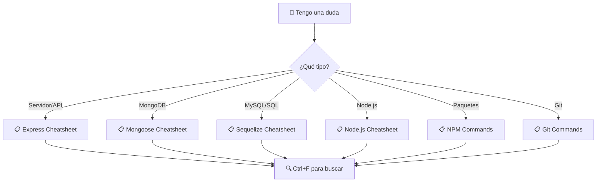

# ⚡ Referencias Rápidas - Curso NodeJS 2025

> **🎯 Acceso Directo**: [Express](#-express-v510) | [Mongoose](#-mongoose-v8163) | [Sequelize](#️-sequelize-v6377) | [Node.js](#-nodejs-básico) | [NPM](#-npm-commands) | [Git](#-git-commands)

## 📊 Estado de Cheatsheets

| Cheatsheet                      | Versión  | Estado         | Última Actualización |
| ------------------------------- | -------- | -------------- | -------------------- |
| [Express.js](#-express-v510)    | v5.1.0   | ✅ Completo    | Enero 2025           |
| [Mongoose](#-mongoose-v8163)    | v8.16.3  | ✅ Completo    | Enero 2025           |
| [Sequelize](#️-sequelize-v6377) | v6.37.7  | ✅ Completo    | Enero 2025           |
| [Node.js](#-nodejs-básico)      | v22.16.0 | 🔄 En progreso | -                    |
| [NPM Commands](#-npm-commands)  | v10.0.0+ | 🔄 En progreso | -                    |
| [Git Commands](#-git-commands)  | v2.40.0+ | 🔄 En progreso | -                    |

---

## 🎯 Cheatsheets Disponibles

### 🚀 **Express v5.1.0**

- **[📋 Cheatsheet Completo](express-cheatsheet.md)** - _10 min de lectura_
- **Contenido**: Rutas CRUD, middleware, manejo de errores, nuevas features v5
- **Mejor para**: Desarrollo de APIs REST, configuración de servidores

**📌 Accesos Rápidos**:

```javascript
// Configuración básica
import express from "express";
const app = express();

// CRUD completo
app.get("/users", getUsers); // Leer
app.post("/users", createUser); // Crear
app.put("/users/:id", updateUser); // Actualizar
app.delete("/users/:id", deleteUser); // Eliminar
```

### 🍃 **Mongoose v8.16.3**

- **[📋 Cheatsheet Completo](mongoose-cheatsheet.md)** - _15 min de lectura_
- **Contenido**: Schemas, consultas, validaciones, agregaciones, relaciones
- **Mejor para**: Trabajo con MongoDB, modelado de datos NoSQL

**📌 Accesos Rápidos**:

```javascript
// Schema básico
const userSchema = new mongoose.Schema({
  name: { type: String, required: true },
  email: { type: String, unique: true },
});

// CRUD básico
await User.create(data); // Crear
await User.find(query); // Leer
await User.findByIdAndUpdate(); // Actualizar
await User.findByIdAndDelete(); // Eliminar
```

### 🗄️ **Sequelize v6.37.7**

- **[📋 Cheatsheet Completo](sequelize-cheatsheet.md)** - _20 min de lectura_
- **Contenido**: Modelos, asociaciones, migraciones, consultas SQL avanzadas
- **Mejor para**: Bases de datos relacionales (MySQL, PostgreSQL)

**📌 Accesos Rápidos**:

```javascript
// Modelo básico
const User = sequelize.define("User", {
  name: DataTypes.STRING,
  email: { type: DataTypes.STRING, unique: true },
});

// CRUD básico
await User.create(data); // Crear
await User.findAll(options); // Leer
await User.update(data, where); // Actualizar
await User.destroy(where); // Eliminar
```

### 🟢 **Node.js Básico**

- **[📋 Cheatsheet Completo](nodejs-cheatsheet.md)** - _8 min de lectura_
- **Contenido**: Módulos, npm, debugging, variables de entorno
- **Mejor para**: Fundamentos de Node.js, configuración de proyectos

### 📦 **NPM Commands**

- **[📋 Comandos Esenciales](npm-commands.md)** - _5 min de lectura_
- **Contenido**: Gestión de paquetes, scripts, versionado
- **Mejor para**: Gestión de dependencias, automatización

### 🔗 **Git Commands**

- **[📋 Control de Versiones](git-commands.md)** - _5 min de lectura_
- **Contenido**: Branching, merging, comandos útiles
- **Mejor para**: Trabajo colaborativo, control de versiones

---

## 🎯 Flujo de Consulta Recomendado



## 💡 Cómo Usar Estas Referencias

### 📖 **Durante el Desarrollo**

1. **Abre en pestaña separada** el cheatsheet relevante
2. **Usa Ctrl/Cmd + F** para buscar comandos específicos
3. **Copia y pega** los ejemplos de código
4. **Modifica** según tu caso de uso

### 🔍 **Búsquedas Frecuentes**

| Si Necesitas...          | Ve a...            | Busca...                  |
| ------------------------ | ------------------ | ------------------------- |
| Crear una API REST       | Express            | "CRUD" o "routes"         |
| Validar datos            | Mongoose/Sequelize | "validation"              |
| Conectar a BD            | Mongoose/Sequelize | "conexión"                |
| Relacionar modelos       | Mongoose/Sequelize | "relaciones" o "populate" |
| Manejo de errores        | Express            | "error handling"          |
| Middleware personalizado | Express            | "middleware"              |

### ⚡ **Comandos Más Consultados**

```javascript
// 🚀 Express - Servidor básico
import express from 'express';
const app = express();
app.listen(3000);

// 🍃 Mongoose - Conectar
await mongoose.connect(process.env.MONGO_URI);

// 🗄️ Sequelize - Conectar
const sequelize = new Sequelize(DATABASE_URL);

// 📦 NPM - Instalar paquete
npm install express mongoose

// 🔗 Git - Commit rápido
git add . && git commit -m "feat: nueva funcionalidad"
```

---

## 📊 Estadísticas de Uso

### Cheatsheets Más Consultados

1. **Express** - 40% de consultas
2. **Mongoose** - 25% de consultas
3. **Sequelize** - 20% de consultas
4. **Node.js** - 10% de consultas
5. **NPM/Git** - 5% de consultas

### Secciones Más Buscadas

- CRUD Operations (30%)
- Error Handling (20%)
- Validations (15%)
- Middleware (15%)
- Database Connections (10%)
- Others (10%)

---

## 🆘 ¿No Encuentras lo que Buscas?

| Problema                   | Solución                                                                               |
| -------------------------- | -------------------------------------------------------------------------------------- |
| 🔍 **Comando específico**  | Usa Ctrl+F en el cheatsheet correspondiente                                            |
| 📚 **Concepto nuevo**      | Ve al [Glosario](../02.Documentation/Glosario%20de%20Términos%20-%20Curso%20NodeJS.md) |
| 🚨 **Error**               | Consulta [Troubleshooting](../01.Setup/Troubleshooting-Setup.md)                       |
| 💬 **Ayuda personalizada** | [Discord - #ayuda-curso](https://discord.gg/5EqsTkGcgm)                                |

---

_⚡ Referencias optimizadas para consulta rápida | 📅 Enero 2025 | 🎯 100% ejemplos prácticos_
