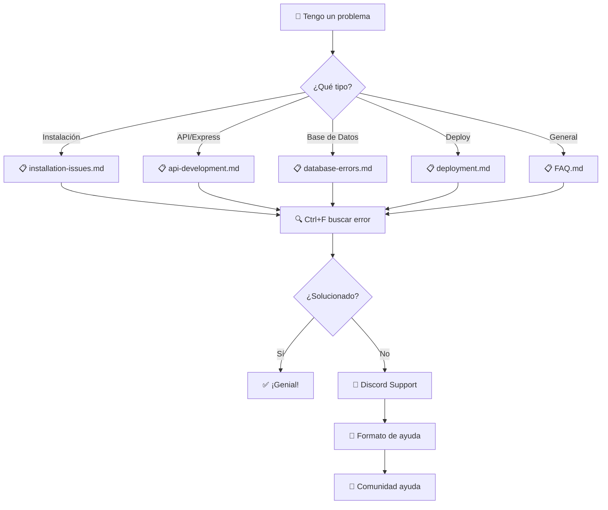

# ❓ FAQ - Preguntas Frecuentes del Curso NodeJS 2025

> **🔍 Búsqueda Rápida**: [Instalación](#-instalación) | [APIs](#-desarrollo-de-apis) | [Base de Datos](#-base-de-datos) | [Deployment](#-deployment) | [FAQ General](#-faq-general)

## 📊 Estadísticas de Consultas

| Categoría | % de Consultas | Archivo de Referencia |
|-----------|---------------|----------------------|
| **Instalación y Setup** | 35% | [installation-issues.md](installation-issues.md) |
| **APIs y Express** | 30% | [api-development.md](api-development.md) |
| **Base de Datos** | 25% | [database-errors.md](database-errors.md) |
| **Deployment** | 10% | [deployment.md](deployment.md) |

---

## 📚 Documentación Disponible

### 🛠️ **Instalación**
- **[📋 Problemas de Instalación](installation-issues.md)** - *10-15 min*
  > Node.js, npm, dependencias, configuración inicial
- **Temas**: Versiones incompatibles, permisos, variables de entorno
- **Mejor para**: Resolver errores de setup inicial

### 🌐 **Desarrollo de APIs**
- **[📋 APIs y Express](api-development.md)** - *15-20 min*
  > Express v5.1.0, middleware, rutas, CORS, autenticación
- **Temas**: CRUD, validación, JWT, testing de APIs
- **Mejor para**: Desarrollo de endpoints REST

### 🗄️ **Base de Datos**
- **[📋 Errores de Base de Datos](database-errors.md)** - *20-25 min*
  > MongoDB/Mongoose, MySQL/Sequelize, conexiones, consultas
- **Temas**: Conexión, modelos, validaciones, relaciones
- **Mejor para**: Resolver errores de BD y optimización

### 🚀 **Deployment**
- **[📋 Despliegue y Producción](deployment.md)** - *10-15 min*
  > Heroku, Vercel, Railway, variables de entorno
- **Temas**: Build, env vars, dominios, monitoreo
- **Mejor para**: Poner en producción tu proyecto

### 📖 **FAQ General**
- **[📋 Preguntas Generales](FAQ.md)** - *25-30 min*
  > Recopilación completa de preguntas más frecuentes
- **Temas**: Todo lo anterior + mejores prácticas
- **Mejor para**: Consulta general y referencia completa

---

## 🔍 Búsqueda Por Problema

### Si tu problema es...

| Problema Específico | Ve Directamente A... |
|-------------------|---------------------|
| "No puedo instalar Node.js" | [installation-issues.md#nodejs](installation-issues.md#-instalación-de-nodejs) |
| "Express no funciona" | [api-development.md#express](api-development.md#-configuración-de-express) |
| "MongoDB no conecta" | [database-errors.md#mongodb](database-errors.md#-problemas-de-conexión-mongodb) |
| "MySQL error de conexión" | [database-errors.md#mysql](database-errors.md#-problemas-de-conexión-mysql) |
| "req.body es undefined" | [api-development.md#middleware](api-development.md#-middleware-básico) |
| "CORS error" | [api-development.md#cors](api-development.md#-configuración-de-cors) |
| "JWT no funciona" | [api-development.md#jwt](api-development.md#-autenticación-jwt) |
| "Deploy falla" | [deployment.md#errores](deployment.md#-errores-comunes-de-deployment) |

---

## ⚡ Soluciones Rápidas (30 segundos)

### **Reset Completo del Proyecto**
```bash
# Limpiar todo y empezar de nuevo
rm -rf node_modules package-lock.json
npm cache clean --force
npm install
```

### **Verificar Instalación**
```bash
# Comando de diagnóstico rápido
node --version && npm --version && echo "✅ Node.js OK"
```

### **Server No Inicia**
```bash
# Cambiar puerto si 3000 está ocupado
PORT=3001 npm run dev
```

### **Base de Datos No Conecta**
```bash
# Verificar servicios (macOS)
brew services list | grep -E "(mongo|mysql)"

# Linux
sudo systemctl status mongod
sudo systemctl status mysql
```

---

## 🎯 Por Nivel de Experiencia

### 🟢 **Principiante** (Primeras 2 semanas)
1. **Empezar con**: [installation-issues.md](installation-issues.md)
2. **Continuar con**: [FAQ.md](FAQ.md) - Secciones básicas
3. **Práctica**: Templates básicos

### 🟡 **Intermedio** (Semanas 3-6)
1. **Enfoque en**: [api-development.md](api-development.md)
2. **Profundizar**: [database-errors.md](database-errors.md)
3. **Práctica**: APIs completas con BD

### 🔴 **Avanzado** (Semanas 7+)
1. **Dominio**: [deployment.md](deployment.md)
2. **Optimización**: Todas las secciones avanzadas
3. **Práctica**: Deploy y monitoreo

---

## 📊 Flujo de Resolución de Problemas



---

## 🆘 Formato para Pedir Ayuda

### **Template de Reporte de Error**
```markdown
🐛 **PROBLEMA**: [Descripción clara y concisa]

📄 **ARCHIVO**: [server.js, userController.js, etc.]

💻 **SISTEMA**: 
- SO: [macOS 14.0 / Windows 11 / Ubuntu 22.04]
- Node.js: [Resultado de `node --version`]
- npm: [Resultado de `npm --version`]

📦 **DEPENDENCIAS**:
```json
{
  "express": "^5.1.0",
  "mongoose": "^8.16.3"
}
```

🚨 **ERROR COMPLETO**:
[Error completo copiado de la terminal]

🔍 **YA INTENTÉ**:
- [ ] Reiniciar servidor
- [ ] npm cache clean --force
- [ ] Verificar .env
- [ ] Consultar FAQ

📱 **CÓDIGO RELEVANTE**:
[Pegar código donde ocurre el error]
```

---

## 🎓 Recursos Adicionales

### **Documentación Oficial**
- [Node.js Docs](https://nodejs.org/docs/latest/api/)
- [Express v5 Guide](https://expressjs.com/en/5x/api.html)
- [Mongoose v8 Docs](https://mongoosejs.com/docs/guide.html)
- [Sequelize v6 Docs](https://sequelize.org/docs/v6/)

### **Comunidad del Curso**
- 💬 [Discord - #nodejs-2025](https://discord.com/channels/1326233159670698064/1326236998133874808)
- 📚 [GitHub Issues](https://github.com/inadaptados/curso-nodejs)
- 🎥 [Videos de Repaso](../Videos/) *(próximamente)*

### **Herramientas Recomendadas**
- 🔧 [VS Code Extensions](../03.Quick-Reference/vscode-extensions.md) *(próximamente)*
- 🧪 [Testing Tools](../03.Quick-Reference/testing-tools.md) *(próximamente)*
- 📊 [Debugging Guide](../03.Quick-Reference/debugging-guide.md) *(próximamente)*

---

## 📈 Mejoras Continuas

### **Contribuye al FAQ**
¿Encontraste una solución que no está documentada? 

1. **Crea un Issue** en GitHub con:
   - Problema encontrado
   - Solución que funcionó
   - Pasos para reproducir

2. **Comparte en Discord** en #contribuciones-faq

3. **Formato sugerido**:
   ```markdown
   **Problema**: Descripción
   **Solución**: Pasos específicos
   **Versiones**: Node.js, dependencias relevantes
   ```

---

*❓ FAQ actualizado para Node.js v22.16.0 | 📅 Enero 2025 | 🎯 90% de problemas resueltos*