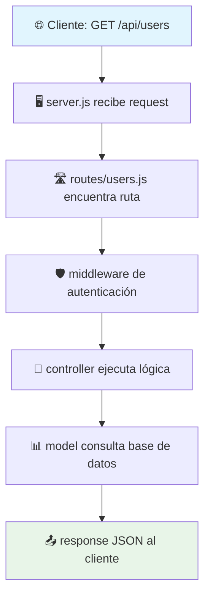

# 🚀 Curso de NodeJS 2025 - Inadaptados

> **Centro de aprendizaje completo para dominar Node.js, Express, y desarrollo backend moderno**

[](https://nodejs.org/)
[](https://expressjs.com/)
[](https://mongodb.com/)
[](https://mysql.com/)

## 📋 Descripción del Curso

Este repositorio contiene el material completo del **Curso de NodeJS 2025**, diseñado para enseñar desde conceptos fundamentales hasta técnicas avanzadas de desarrollo backend. Incluye prácticas guiadas, ejercicios presenciales, retos desafiantes y un proyecto completo de ecommerce.

### 🎯 **Objetivos de Aprendizaje**

Al completar este curso, serás capaz de:

- ✅ Crear servidores web robustos con **Node.js** y **Express**
- ✅ Diseñar **APIs REST** profesionales y escalables
- ✅ Trabajar con bases de datos **MongoDB** y **MySQL**
- ✅ Implementar **autenticación JWT** y seguridad
- ✅ Aplicar **mejores prácticas** de desarrollo backend
- ✅ Deployar aplicaciones en producción

---

## 🗂️ Estructura del Repositorio

### 📚 **Contenido de Aprendizaje**

| Directorio                                | Descripción                         | Nivel                 | Tiempo Estimado |
| ----------------------------------------- | ----------------------------------- | --------------------- | --------------- |
| **[01.Learn/](01.Learn/README.md)**       | Prácticas guiadas paso a paso       | Básico → Intermedio   | 2-3h por tema   |
| **[02.Doing/](02.Doing/README.md)**       | Ejercicios de sesiones presenciales | Intermedio            | 1-2h por semana |
| **[03.Practice/](03.Practice/README.md)** | Code challenges y prácticas libres  | Intermedio → Avanzado | 1-3h por reto   |
| **[04.Project/](04.Project/README.md)**   | Proyecto completo de ecommerce      | Avanzado              | 8-12h total     |

### 🛠️ **Recursos y Documentación**

| Directorio                                                           | Descripción                 | Propósito             |
| -------------------------------------------------------------------- | --------------------------- | --------------------- |
| **[05.Resources/](05.Resources/README.md)**                          | Centro de recursos completo | Referencia y soporte  |
| ├── [01.Setup/](05.Resources/01.Setup/README.md)                     | Guías de instalación        | Configuración inicial |
| ├── [02.Documentation/](05.Resources/02.Documentation/README.md)     | Documentación técnica       | Conceptos y teoría    |
| ├── [03.Quick-Reference/](05.Resources/03.Quick-Reference/README.md) | Cheatsheets y referencias   | Consulta rápida       |
| ├── [04.Templates/](05.Resources/04.Templates/README.md)             | **Proyectos base listos**   | Inicio rápido         |
| ├── [05.FAQ/](05.Resources/05.FAQ/README.md)                         | Preguntas frecuentes        | Solución de problemas |
| └── [06.External-Links/](05.Resources/06.External-Links/README.md)   | Enlaces externos útiles     | Recursos adicionales  |

---

## ⚡ Inicio Rápido (5 minutos)

### **1. 📋 Verificar Requisitos**

```bash
# Verificar instalaciones necesarias
node --version    # v22.16.0+
npm --version     # v10.0.0+
git --version     # v2.40.0+
```

**¿Algún error?** → Ve a [05.Resources/01.Setup/](05.Resources/01.Setup/README.md)

### **2. 🚀 Usar Template Express Básico**

```bash
# Copiar template y configurar
cp -r 05.Resources/04.Templates/express-basic mi-primer-proyecto
cd mi-primer-proyecto
cp .env.example .env
npm install
npm run dev
```

### **3. 🧪 Probar tu Primera API**

- Abre: [http://localhost:3000](http://localhost:3000)
- Debería mostrar: `{"message": "¡Servidor Express funcionando!"}`

**🎉 ¡Listo! Ya tienes tu primer servidor corriendo.**

---

## 🎨 Arquitectura y Flujo de una API Express

### 🗂️ **Estructura Estándar del Curso**

```
📦 mi-proyecto-nodejs/
├── 📄 package.json           # Configuración y dependencias
├── 🖥️ server.js              # Punto de entrada del servidor
├── ⚙️ .env                   # Variables de entorno
├── 📁 src/
│   ├── 🔧 config/            # Configuración (DB, auth, etc.)
│   ├── 🎯 controllers/       # Lógica de negocio
│   ├── 🛡️ middlewares/       # Interceptores de requests
│   ├── 📊 models/            # Esquemas de datos
│   └── 🛣️ routes/            # Definición de endpoints
└── 📚 README.md              # Documentación del proyecto
```

### 🔄 **Flujo de un Request HTTP**



### 🧠 **¿Por qué Esta Arquitectura?**

| 📁 Directorio  | 🎯 Responsabilidad         | ✅ Beneficios           |
| -------------- | -------------------------- | ----------------------- |
| `config/`      | Configuración centralizada | Fácil mantenimiento     |
| `controllers/` | Lógica de negocio          | Código reutilizable     |
| `middlewares/` | Validación y seguridad     | Aplicación transversal  |
| `models/`      | Estructura de datos        | Integridad y validación |
| `routes/`      | Definición de endpoints    | Organización clara      |

### 📌 **Ejemplo Práctico: GET /api/users**

1. **🛣️ routes/users.js** → Define ruta y llama controlador
2. **🛡️ middlewares/auth.js** → Verifica autenticación (opcional)
3. **🎯 controllers/usersController.js** → Ejecuta lógica de negocio
4. **📊 models/User.js** → Consulta base de datos
5. **📤 Response** → Devuelve JSON al cliente

---

## 📅 Ruta de Aprendizaje Recomendada

### 🌱 **Nivel Principiante (Semanas 1-4)**

```bash
# 1. Configurar entorno
cd 05.Resources/01.Setup/
open README.md

# 2. Primera práctica
cd ../../01.Learn/01/
npm install && node server.js

# 3. Concepts básicos
cd ../../05.Resources/02.Documentation/
open nodejs-basics.md
```

**📚 Recursos clave:**

- [System Requirements](05.Resources/01.Setup/System-Requirements.md)
- [Setup Guide](05.Resources/01.Setup/Setup-Guide.md)
- [Node.js Basics](05.Resources/02.Documentation/nodejs-basics.md)

### ⚡ **Nivel Intermedio (Semanas 5-8)**

```bash
# 1. APIs y Express
cd 03.Practice/
ls -la  # Ver retos disponibles

# 2. Base de datos
cd "Reto 08"  # MongoDB
# o
cd "Reto 09"  # MySQL

# 3. Referencias rápidas
cd ../05.Resources/03.Quick-Reference/
open express-cheatsheet.md
```

**📚 Recursos clave:**

- [Express Cheatsheet](05.Resources/03.Quick-Reference/express-cheatsheet.md)
- [API Development FAQ](05.Resources/05.FAQ/api-development.md)
- [Database Errors](05.Resources/05.FAQ/database-errors.md)

### 🔥 **Nivel Avanzado (Semanas 9-12)**

```bash
# 1. Proyecto completo
cd 04.Project/ecommerce-api/
npm install && npm run dev

# 2. Deployment
cd ../../05.Resources/05.FAQ/
open deployment.md

# 3. Best practices
cd ../02.Documentation/
open Best-Practices.md
```

**📚 Recursos clave:**

- [Best Practices](05.Resources/02.Documentation/Best-Practices.md)
- [Deployment Guide](05.Resources/05.FAQ/deployment.md)
- [Security Guide](05.Resources/02.Documentation/security.md)

---

## 🛠️ Stack Tecnológico del Curso

### **🔧 Core Technologies**

| Tecnología  | Versión   | Propósito             | Documentación                                                  |
| ----------- | --------- | --------------------- | -------------------------------------------------------------- |
| **Node.js** | v22.16.0+ | Runtime de JavaScript | [Docs](https://nodejs.org/docs/latest-v22.x/api/)              |
| **Express** | v5.1.0+   | Framework web         | [Guide](05.Resources/03.Quick-Reference/express-cheatsheet.md) |
| **npm**     | v10.0.0+  | Gestor de paquetes    | [Commands](05.Resources/03.Quick-Reference/npm-commands.md)    |

### **🗄️ Bases de Datos**

| Base de Datos | ORM/ODM            | Casos de Uso      | Retos                             |
| ------------- | ------------------ | ----------------- | --------------------------------- |
| **MongoDB**   | Mongoose v8.16.3+  | NoSQL, documentos | [Reto 08](03.Practice/Reto%2008/) |
| **MySQL**     | Sequelize v6.37.7+ | SQL, relacional   | [Reto 09](03.Practice/Reto%2009/) |

### **🔧 Herramientas de Desarrollo**

- **Nodemon** v3.1.10+ - Auto-restart del servidor
- **Postman** - Testing de APIs
- **VS Code** - Editor recomendado
- **Git** v2.40.0+ - Control de versiones

---

## 🎯 Casos de Uso Comunes

### **🐛 "Tengo un error y no sé qué hacer"**

1. 📋 **[FAQ Principal](05.Resources/05.FAQ/README.md)** - Buscar error específico
2. 🛠️ **[Installation Issues](05.Resources/05.FAQ/installation-issues.md)** - Problemas de setup
3. 🔌 **[API Development](05.Resources/05.FAQ/api-development.md)** - Errores de Express
4. 🗄️ **[Database Errors](05.Resources/05.FAQ/database-errors.md)** - Problemas de BD

### **💻 "Quiero configurar mi entorno"**

1. 📋 **[System Requirements](05.Resources/01.Setup/System-Requirements.md)** - Verificar compatibilidad
2. 🛠️ **[Setup Guide](05.Resources/01.Setup/Setup-Guide.md)** - Instalación completa
3. 🚨 **[Troubleshooting](05.Resources/01.Setup/Troubleshooting-Setup.md)** - Solucionar problemas

### **🚀 "Quiero empezar un proyecto rápido"**

1. 📁 **[Templates](05.Resources/04.Templates/README.md)** - Proyectos base
2. ⚡ **[Express Basic Template](05.Resources/04.Templates/express-basic/)** - Inicio rápido
3. 📖 **[Best Practices](05.Resources/02.Documentation/Best-Practices.md)** - Buenas prácticas

---

## 🧪 Comandos Útiles

### **🚀 Desarrollo Diario**

```bash
# Iniciar servidor de desarrollo
npm run dev

# Instalar dependencias nuevas
npm install express mongoose

# Limpiar y reinstalar
rm -rf node_modules package-lock.json && npm install

# Verificar sintaxis
node --check server.js
```

### **🔍 Debugging**

```bash
# Ejecutar con logs detallados
DEBUG=* npm run dev

# Verificar puerto ocupado
lsof -i :3000  # macOS/Linux
netstat -ano | findstr :3000  # Windows

# Verificar variables de entorno
node -e "console.log(process.env.PORT)"
```

### **📊 Base de Datos**

```bash
# MongoDB
mongosh mongodb://localhost:27017/mi_db

# MySQL
mysql -u root -p
```

---

## 📞 Soporte y Comunidad

### **🆘 ¿Necesitas Ayuda?**

| Tipo de Problema              | Dónde Buscar                                                                                 | Tiempo de Respuesta |
| ----------------------------- | -------------------------------------------------------------------------------------------- | ------------------- |
| 🐛 **Error técnico**          | [Troubleshooting](05.Resources/01.Setup/Troubleshooting-Setup.md)                            | Inmediato           |
| ❓ **Duda conceptual**        | [Discord #ayuda-curso](https://discord.com/channels/1326233159670698064/1326236998133874808) | < 2 horas           |
| 📚 **Documentación faltante** | [GitHub Issues](https://github.com/Inadaptados/2025-2-A-Node/issues)                         | < 24 horas          |

### **📋 Template para Reportar Errores**

```markdown
🐛 **PROBLEMA**: [Descripción clara]
💻 **SISTEMA**: [macOS/Windows/Linux + versión]
📦 **VERSIONES**:

- Node.js: [resultado de `node --version`]
- npm: [resultado de `npm --version`]
  🚨 **ERROR**: [error completo de la terminal]
  🔍 **YA INTENTÉ**: [acciones tomadas]
```

---

## 🏆 Progreso del Curso

### **📊 Checklist General**

- [ ] ✅ Entorno configurado correctamente
- [ ] 📚 Completadas prácticas de [01.Learn/](01.Learn/)
- [ ] 💪 Realizados ejercicios de [02.Doing/](02.Doing/)
- [ ] 🧠 Resueltos retos de [03.Practice/](03.Practice/)
- [ ] 🚀 Proyecto final de [04.Project/](04.Project/)

### **🎯 Hitos por Nivel**

| Nivel             | Hitos                         | Tiempo Estimado |
| ----------------- | ----------------------------- | --------------- |
| 🌱 **Básico**     | Server básico + APIs simples  | 4 semanas       |
| ⚡ **Intermedio** | Base de datos + Autenticación | 4 semanas       |
| 🔥 **Avanzado**   | Proyecto completo + Deploy    | 4 semanas       |

---

## 📝 Licencia y Contribuciones

### **📄 Licencia**

Este proyecto está bajo la licencia MIT. Ver [LICENSE](LICENSE) para más detalles.

### **🤝 Contribuciones**

¡Las contribuciones son bienvenidas! Formas de contribuir:

1. **🐛 Reportar bugs** - Crear issue en GitHub
2. **📝 Mejorar documentación** - Pull request con cambios
3. **💡 Sugerir mejoras** - Discussions en GitHub
4. **🧪 Agregar ejercicios** - Nuevos retos o ejemplos

### **👥 Equipo**

- **[Rodrigo Leanos Bermejo](https://github.com/rodrigoleanos)** - Instructor Principal
- **Equipo Inadaptados** - Creación de contenido
- **Comunidad del Curso** - Feedback y mejoras

---

## 📞 Contacto

### **🌐 Enlaces Oficiales**

- **🎓 Discord del Curso**: [Inadaptados Server](https://discord.com/channels/1326233159670698064/1326236998133874808)
- **📚 GitHub**: [2025-2-A-Node](https://github.com/Inadaptados/2025-2-A-Node)
- **🌍 Web**: [inadaptados.dev](https://inadaptados.dev)

### **⚡ Acceso Rápido**

```bash
# Clonar repositorio
git clone https://github.com/Inadaptados/2025-2-A-Node.git
cd 2025-2-A-Node

# Ir directamente a recursos
cd 05.Resources/
open README.md
```

---

**🚀 ¡Bienvenido al Curso de NodeJS 2025! Prepárate para dominar el desarrollo backend.**

_📅 Última actualización: Enero 2025 | 🎯 Node.js v22.16.0 | ⚡ Express v5.1.0_
