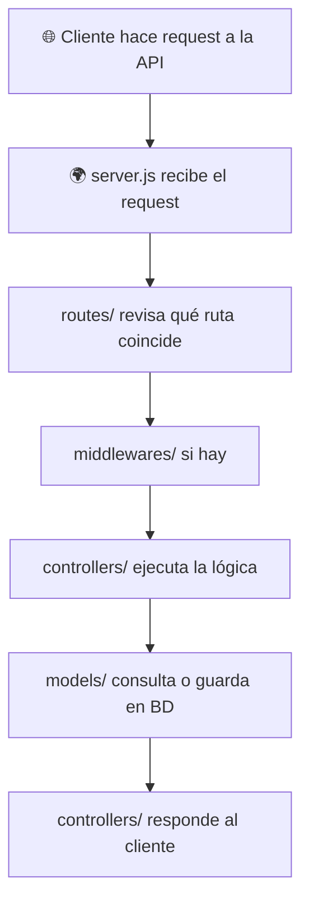

# Curso de NodeJS

Este repositorio contiene el material del curso de NodeJS, incluyendo prácticas guiadas, ejercicios presenciales y retos para practicar de manera autónoma. Está diseñado para enseñar y reforzar los conceptos fundamentales y avanzados de NodeJS.

## Estructura del Repositorio

- [01.Learn](01.Learn/README.md): Prácticas guiadas con ejemplos y explicaciones paso a paso.
- [02.Doing](02.Doing/README.md): Ejercicios prácticos para realizar durante las sesiones presenciales.
- [03.Practice](03.Practice/README.md): Espacio para prácticas libres y code challenges.
- [04.Project](04.Project/README.md): Ejemplo de proyecto de ecommerce.

## Requisitos Previos

- Tener instalado [Node.js](https://nodejs.org/) (versión recomendada: LTS).
- Tener instalado [npm](https://www.npmjs.com/) (se instala junto con Node.js).

## 🎨 Estructura y Flujo de una API con Express + Node.js

### 🗂️ Estructura del Proyecto

Durante el curso aprenderemos a construir APIs siguiendo esta estructura organizada y escalable:

```
📦 Proyecto API
├── package.json           # Configura el proyecto y dependencias
├── server.js              # Punto de entrada principal del servidor
└── src/
    ├── config/            # Configuración general (DB, env, etc.)
    ├── controllers/       # Lógica que responde a las rutas
    ├── middlewares/       # Funciones que interceptan requests
    ├── models/            # Esquemas de datos (ej. MongoDB o MySql)
    └── routes/            # Define los endpoints de la API
```

### 🔄 Flujo de un Request en la API



### 🧠 ¿Por qué esta estructura?

| Carpeta        | Propósito                                          |
| -------------- | -------------------------------------------------- |
| `config/`      | Centralizar la configuración del proyecto          |
| `controllers/` | Separar la lógica de negocio de las rutas          |
| `middlewares/` | Añadir seguridad, validaciones, logs, etc.         |
| `models/`      | Mantener estructura y validación de datos          |
| `routes/`      | Organizar y conectar endpoints a sus controladores |

### 📌 Ejemplo de flujo: `GET /api/users`

1. **routes/users.js** define la ruta → llama a `getUsers` del controlador
2. Si hay, pasa por **middlewares/auth.js**
3. **controllers/usersController.js** llama a **models/User.js**
4. Devuelve la lista de usuarios al cliente

## Ejecución

Cada carpeta contiene su propio archivo `README.md` con instrucciones específicas. Por lo general, puedes iniciar el servidor o la práctica con:

```bash
node server.js
```

O siguiendo las instrucciones particulares de cada carpeta.

## Recomendaciones

- Aprovecha los diferentes espacios del repositorio para aprender, practicar y experimentar.
- Consulta la documentación oficial de Node.js y los recursos proporcionados en el curso.
- Comparte tus dudas y soluciones en los canales de comunicación del curso para recibir retroalimentación.

## Licencia

Este proyecto está bajo la licencia MIT. Consulta el archivo [LICENSE](LICENSE) para más detalles.

## Contribuciones

¡Las contribuciones son bienvenidas! Si deseas mejorar el material o agregar nuevos ejercicios, abre un pull request o crea un issue.

## Autor

Equipo de Inadaptados - [GitHub](https://github.com/Inadaptados/2025-2-A-Node)

## Contacto

¿Tienes preguntas o necesitas ayuda? Contáctanos a través de nuestro [Discord](https://discord.com/channels/1326233159670698064/1326236998133874808)
